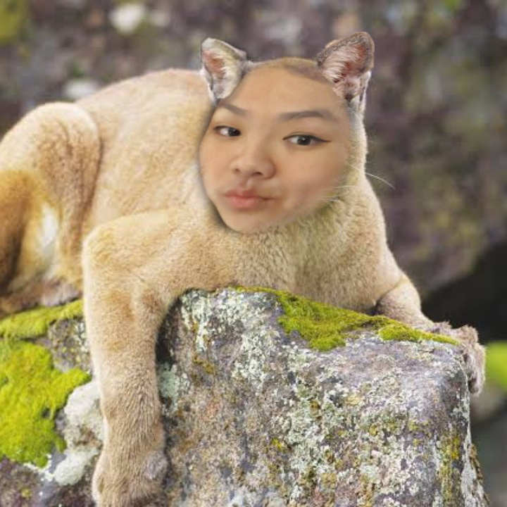

<!DOCTYPE html>
<html lang="en">
<head>
    <meta charset="UTF-8">
    <meta name="viewport" content="width=device-width, initial-scale=1.0">
    <title>Valentine's Surprise ❤️</title>
    
</head>
<body>
    <h1 class="title">For the love of my life who I adore so much</h1>

    

        <button onclick="showSurprise()">Click Here for a Surprise!</button>
        

            <button onclick="showQuiz()">Take a Fun Love Quiz 💘</button>
            <button onclick="showStoryPopup()">Read Our Love Story 📖</button>
            <button onclick="showLetterPopup()">A Special Letter for You 💌</button>
        

    

    

        

        

        

        <button onclick="nextQuestion()">Next</button>
        <button onclick="closePopup('quiz-popup')">Close</button>
    

    

        <h2>Our Love Story</h2>
        
<a href="your-story-file.pdf" target="_blank">Click here to read our love story ❤️</a>

        <button onclick="closePopup('story-popup')">Close</button>
    

    

        <h2>A Special Letter for You 💌</h2>
        
My love, every moment with you is magical. You are my world, my everything... 💖

        <button onclick="closePopup('letter-popup')">Close</button>
    

    

    
    
    
</body>
</html>

